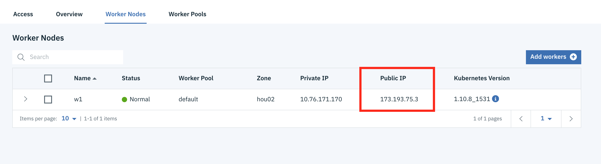

# Monitor Custom Machine Learning engine with AI OpenScale

In this Code Pattern, we will log the payload for a model deployed on custom model serving engine using AI OpenScale python sdk. We'll use [Keras to build a deep learning REST API](https://blog.keras.io/building-a-simple-keras-deep-learning-rest-api.html) and then monitor with [AI Open Scale](https://console.bluemix.net/docs/services/ai-openscale/getting-started.html).

When the reader has completed this Code Pattern, they will understand how to:

* Build a custom model serving engine using [Keras](https://keras.io/)
* Access the custom model using a REST API
* Log the payload for the model using [AI OpenScale](https://console.bluemix.net/docs/services/ai-openscale/connect-ml.html#connect-ml)


## Flow

1. User deploys application server on the IBM Cloud using Kubernetes and Docker.
2. User creates a Jupyter notebook on Watson Studio and configures AI OpenScale and Compose PostgreSQL.
3. AI OpenScale is used to monitor a Machine Learning model for payload logging and quality.
4. The application server is used for scoring the deployed model.

## Prerequisites

* An [IBM Cloud Account](https://console.bluemix.net).
* An account on [IBM Watson Studio](https://dataplatform.ibm.com) or a way to run a [Jupyter Notebook](https://jupyter.org/) locally
* For Kubernetes deployment, setup [IBM Cloud CLI](https://console.bluemix.net/docs/cli/index.html#overview) and any other required [Kubernetes prerequisites](https://console.bluemix.net/docs/containers/cs_tutorials.html#prerequisites)

# Steps

1. [Clone the repo](#1-clone-the-repo)
2. [Create Watson services with IBM Cloud](#2-create-watson-services-with-ibm-cloud)
3. [Create a notebook in IBM Watson Studio](#3-create-a-notebook-in-ibm-watson-studio) for use with a publicly addressed server OR
   Run the notebook locally for local testing only
4. Perform either 4a for use with Watson Stuido or 4b for local testing only:  
    4a. [Run the application server in a Kubernetes cluster](#4a-run-the-application-server-in-a-kubernetes-cluster)  
    4b. [Run the application server locally](#4b-run-the-application-server-locally)  
5. [Run the notebook in IBM Watson Studio](#5-run-the-notebook-in-ibm-watson-studio)

### 1. Clone the repo

Clone the `monitor-custom-ml-engine-with-ai-openscale` locally. In a terminal, run:

```bash
git clone https://github.com/IBM/monitor-custom-ml-engine-with-ai-openscale
```

### 2. Create Watson services with IBM Cloud

> Note: If you are using [Watson Studio]() for your notebook, services created must be in the same region, and space, as your Watson Studio service.

Create the following services:

* [AI OpenScale](https://console.bluemix.net/catalog/services/ai-openscale)
  You will get the AI OpenScale instance GUID when you run the notebook using the [IBM Cloud CLI](https://console.bluemix.net/catalog/services/ai-openscale)

* [Compose for PostgreSQL DB](https://console.bluemix.net/catalog/services/compose-for-postgresql)


* Wait a couple of minutes for the database to be provisioned.
* Click on the `Service Credentials` tab on the left and then click `New credential +` to create the service credentials. Copy them or leave the tab open to use later in the notebook.

### 3. Create a notebook in IBM Watson Studio

* In [Watson Studio](https://dataplatform.ibm.com), create a `New project`.
* Using the project you've created, click on `+ Add to project` and then choose the  `Notebook` tile, OR in the `Assets` tab under `Notebooks` choose `+ New notebook` to create a notebook.
* Select the `From URL` tab.
* Enter a name for the notebook.
* Optionally, enter a description for the notebook.
* Under `Notebook URL` provide the following url: https://raw.githubusercontent.com/IBM/monitor-custom-ml-engine-with-ai-openscale/notebooks/AIOpenScaleAndCustomMLEngine.ipynb
* Select the `Default Python 3.5` runtime, either `Free` or `XS`.
* Click the `Create` button.

### 4a. Run the application server in a Kubernetes cluster

* Create a [Kubernetes cluster on IBM Cloud](https://console.bluemix.net/containers-kubernetes/catalog/cluster)
- This must be in the `Dallas` region, the same region as the [AI OpenScale](https://console.bluemix.net/catalog/services/ai-openscale) instance.
- Select either the `Free` or `Standard` tier.

* When the provisioning is completed use the worker node Public IP to update the `PUBLIC_IP` value in the [run_server.py](run_server.py) file.



* Create registry namespace with your unique namespace_name

```bash
ibmcloud cr namespace-add <namespace_name>
```

* Config kubernetes cluster

```bash
ibmcloud ks cluster-config <cluster_name_or_ID>
```

- Copy the returned command and run. It will look like:

```bash
export KUBECONFIG=/Users/<user_name>/.bluemix/plugins/container-service/clusters/pr_firm_cluster/kube-config-prod-par02-pr_firm_cluster.yml
```

* Build and publish the docker image (`<region>` will likely be `ng`)

```bash
ibmcloud cr build -t registry.<region>.bluemix.net/<namespace>/custom-ml-engine:1 .
```

* Deploy the application and expose the port

```bash
kubectl run custom-ml-engine-deployment --image=registry.<region>.bluemix.net/<namespace>/custom-ml-engine:1
kubectl create -f service.yaml
```

* Get the exposed NodePort and worker node public IP

```bash
kubectl describe service custom-ml-engine-service
ibmcloud ks workers <cluster_name_or_ID>
```

The application will be available with the following URL: `http://<IP_address>:<NodePort>`

### 4.b Run the application server locally

> NOTE: Running locally will require Python 3.5 or 3.6 (later versions will not work with Tensorflow).
If you run the server locally, it may not have a publicly addressible IP address, if you are behind a firewall or local router. You would therefore also have to run the [Jupyter notebook](https://jupyter.org/) locally as well.

* It is recommended that you use a [Python virtualenv](https://pypi.org/project/virtualenv/)

```bash
python -m venv mytestenv       # Python 3.X

# Now source the virtual environment. Use one of the two commands depending on your OS.
source mytestenv/bin/activate  # Mac or Linux
./mytestenv/Scripts/activate   # Windows PowerShell
```

* Run:

```bash
pip install -r requirements.txt
python run_server.py
```

Application server will be available at http://127.0.0.1:5000

### 5. Run the notebook in IBM Watson Studio

* Follow the instructions for `ACTION: Get data_mart_id (GUID) and apikey` using the [IBM Cloud CLI](https://console.bluemix.net/docs/cli/index.html#overview)

Get an IAM apikey:
```
ibmcloud login --sso
ibmcloud iam api-key-create 'my_key'
```

Get AI OpenScale instance GUID:
```
ibmcloud resource service-instance <AIOpenScale_instance_name>
```

* Enter the `GUID` as the `instance_guid` and the iam `API Key` as the `apikey` in the next cell for the `AIOS_CREDENTIALS`.
* In the cell after `ACTION: Add your PostgreSQL credentials here` enter the credentials from the [Compose for PostgreSQL DB](https://console.bluemix.net/catalog/services/compose-for-postgresql) that you created earlier.

* Move your cursor to each code cell and run the code in it. Read the comments for each cell to understand what the code is doing. **Important** when the code in a cell is still running, the label to the left changes to **In [\*]**:.
  Do **not** continue to the next cell until the code is finished running.

# Sample output

### GET the application server deployments

Navigate a browser to `http://<ip_address>:<port>/v1/deployments`

Output:

```
{"count":3,"resources":[{"entity":{"asset":{"guid":"resnet50","name":"resnet50"},"asset_properties":{"input_data_type":"unstructured_image","problem_type":"multiclass"},"description":"Keras ResNet50 model deployment for image classification","name":"ResNet50 AIOS compliant deployment","scoring_url":"http://169.60.16.73:31520/v1/deployments/resnet50/online"},"metadata":{"created_at":"2016-12-01T10:11:12Z","guid":"resnet50","modified_at":"2016-12-02T12:00:22Z"}},{"entity":{"asset":{"guid":"resnet50","name":"resnet50"},"asset_properties":{"input_data_type":"unstructured_image","problem_type":"multiclass"},"description":"Keras ResNet50 model deployment for image classification","name":"ResNet50 AIOS non compliant deployment","scoring_url":"http://169.60.16.73:31520/v1/deployments/resnet50_non_compliant/online"},"metadata":{"created_at":"2016-12-01T10:11:12Z","guid":"resnet50_non_compliant","modified_at":"2016-12-02T12:00:22Z"}},{"entity":{"asset":{"guid":"action","name":"area and action prediction"},"asset_properties":{"input_data_type":"structured","problem_type":"multiclass"},"description":"area and action spark models deployment","name":"action deployment","scoring_url":"http://169.60.16.73:31520/v1/deployments/action/online"},"metadata":{"created_at":"2016-12-01T10:11:12Z","guid":"action","modified_at":"2016-12-02T12:00:22Z"}}]}
```

### Run the [test_api.py](test/test_api.py) script following the  [test/README.md](test/README.md) instructions

Output:

```json
 $ python test_api.py
{   'Results:': [   {   'prediction': 'beagle', 'probability': '0.98777544'},
                    {   'prediction': 'pot', 'probability': '0.0020967727'},
                    {   'prediction': 'Cardigan', 'probability': '0.0013517012'},
                    {   'prediction': 'Walker_hound',
                        'probability': '0.0012711119'},
                    {   'prediction': 'Brittany_spaniel',
                        'probability': '0.0010085113'}]}

```

### Run the [notebook](notebooks/AIOpenScaleAndCustomMLEngine.ipynb)

See [example output](examples/exampleNotebook.ipynb)

## License

This code pattern is licensed under the Apache License, Version 2. Separate third-party code objects invoked within this code pattern are licensed by their respective providers pursuant to their own separate licenses. Contributions are subject to the [Developer Certificate of Origin, Version 1.1](https://developercertificate.org/) and the [Apache License, Version 2](https://www.apache.org/licenses/LICENSE-2.0.txt).

[Apache License FAQ](https://www.apache.org/foundation/license-faq.html#WhatDoesItMEAN)
