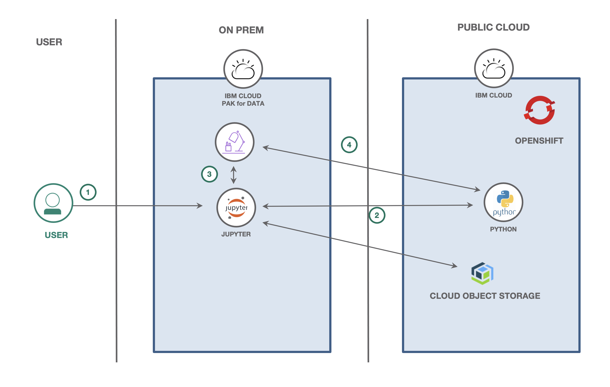
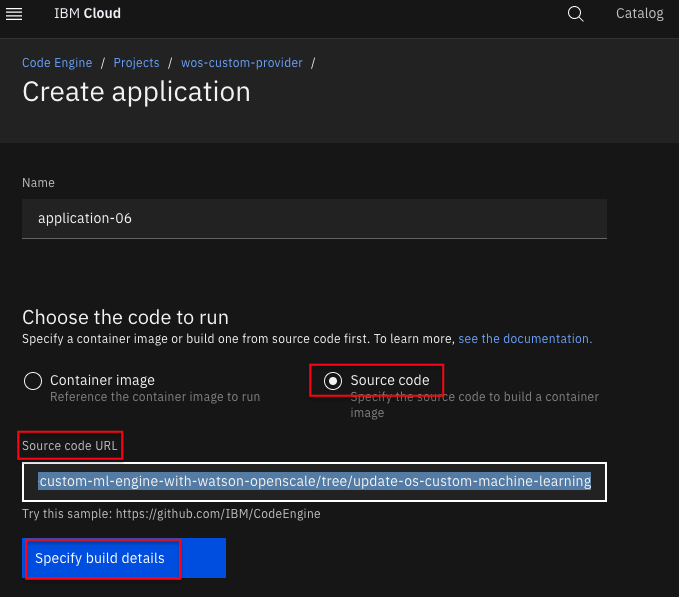
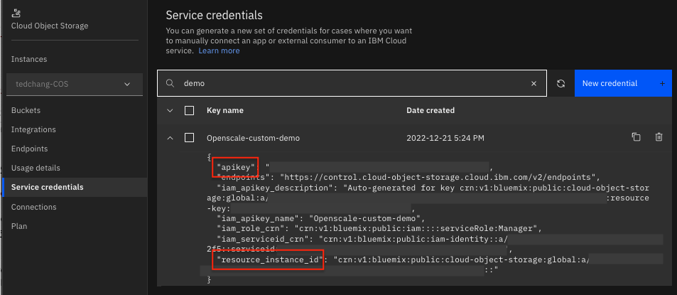

# Monitor Custom Machine Learning engine with Watson OpenScale

In this Code Pattern, we'll demonstrate how to monitor a machine learning model using [Watson OpenScale](https://cloud.ibm.com/catalog/services/watson-openscale). You can using any model deployment serving engine, but we will create one using a Python Flask wrapper with Watson Machine Learning to simulate this.

When the reader has completed this Code Pattern, they will understand how to:

* Create a data mart for a machine learning model with Watson OpenScale.
* Log the payload for the model using Watson OpenScale.
* Configure OpenScale to monitor that deployment for Fairness, Quality, and Drift.




## Flow

1. User deploys application server using VM or CodeEngine on the IBM Cloud .
2. User creates a Jupyter notebook on [Cloud Pak for Data](https://cloud.ibm.com/cloudpaks/data/overview) and configures Watson OpenScale.
3. Watson OpenScale is used to monitor a Machine Learning model for payload logging and quality.
4. The application server is used for scoring the deployed model.

## Prerequisites

* A custom ML framework
* A Machine learning provider backed by a custom ML framework, i.e running in a [Code Engine](https://cloud.ibm.com/codeengine/overview) or VM(i.e. [classic virtual server](https://cloud.ibm.com/gen1/infrastructure/provision/vs)) on the IBM Cloud using the provided Flask app.
* An instance of Cloud Pak for Data
* Watson OpenScale provisioned on Cloud Pak for Data.
* [IBM Cloud Object Storage (COS)](https://cloud.ibm.com/objectstorage/create)

# Steps

1. [Deploy a model](#1-deploy-a-model)
1. [Create custom machine learning provider](#2-create-custom-machine-learning-provider)
1. [Create a Watson OpenScale service](#3-create-a-watson-openscale-service)
1. [Create COS bucket and get credentials](#4-create-cos-bucket-and-get-credentials)
1. [Create a notebook on Cloud Pak for Data](#5-create-a-notebook-on-cloud-pak-for-data)
1. [Run the notebook](#6-run-the-notebook)

## 1. Deploy a model

In this example, we use Watson Machine Learning in IBM public cloud to simulate an existing Custom ML framework. Refer to [Train GermanCreditRisk model and promote to a deployment space](https://developer.ibm.com/tutorials/automate-model-building-with-autoai/) to deploy the model.

<details><summary>Find Space ID, Deployment ID, and Model ID</summary>

* In the [Cloud Pak for Data instance](https://dataplatform.cloud.ibm.com/home2?context=cpdaas), click the (☰) menu and click `Deployment`. From the table, select the deployment space where the model was deployed.


* Find the `Space ID(GUID)` under the `Manage` tab as shown


* Under the `Deployments` tab, select the model which your have deployed earlier


* Find the `Deployment ID` and `Model ID` as shown


</details>

## 2. Create custom machine learning provider

In order to support [Custom ML framework](https://dataplatform.cloud.ibm.com/docs/content/wsj/model/wos-frameworks-custom.html) for Watson OpenScale, implement two REST APIs to wrap the existing custom ML framework:
- /v1/deployments: Lists all deployments. This optional API can be used to configure the OpenScale insight dashboard to discover models in a deployment space. See [Manually configure Machine learning provider](#manually-configure-machine-learning-provider).
- /v1/deployments/{deployment_id}/online: Makes an online prediction. The OpenScale uses this API for scoring requests.

Follow one of methods below to setup a custom machine learning provider which serves the above APIs by:

<details><summary>Custom Machine Learning Provider Setup for VM</summary>

If needed, create a [VM](https://cloud.ibm.com/gen1/infrastructure/provision/vs) on the IBM Cloud. Login the VM in a terminal and clone the [monitor-custom-ml-engine-with-watson-openscale repo](https://github.com/IBM/monitor-custom-ml-engine-with-watson-openscale):

```bash
git clone https://github.com/IBM/monitor-custom-ml-engine-with-watson-openscale
cd monitor-custom-ml-engine-with-watson-openscale
```

The code in app.py can be used to start a Gunicorn/Flask application that can be hosted in a VM, such that it can be accessible from your OpenScale service instance.
This code does the following:
* It wraps a Watson Machine Learning model that is deployed to a space.
* The hosting application URL should contain the SPACE ID and the DEPLOYMENT ID. The app can be used to talk to the target WML model/deployment.
* Having said that, this is only for this tutorial purpose, and you can define your Custom ML provider endpoint in any fashion you want, such that it wraps your own custom ML engine.
* The scoring request and response payload should conform to the schema as described here at: https://aiopenscale-custom-deployement-spec.mybluemix.net/#/


To start the application in the VM using the below code, make sure you install the python packages using:
```sh
python3 -m pip install -r requirements.txt
```

Because the app.py needs to authenticate with the custom ML model deployment, you need to [generate an apikey](https://cloud.ibm.com/iam/apikeys) for WML api client to connect. After generating API, run:
```sh
export APIKEY="<your API key>"
```

Start the API server:
```sh
flask --app app.py run --port=5001 --host=0.0.0.0
```

You should see the app server starting:
```
 * Serving Flask app 'app'
 * Debug mode: on
WARNING: This is a development server. Do not use it in a production deployment. Use a production WSGI server instead.
 * Running on all addresses (0.0.0.0)
```

Test the app by sending an online scoring request:
```sh
curl -XPOST -H "Content-Type: application/json" -d '{"fields":["CheckingStatus","LoanDuration","CreditHistory","LoanPurpose","LoanAmount","ExistingSavings","EmploymentDuration","InstallmentPercent","Sex","OthersOnLoan","CurrentResidenceDuration","OwnsProperty","Age","InstallmentPlans","Housing","ExistingCreditsCount","Job","Dependents","Telephone","ForeignWorker"],"values":[["less_0",11,"prior_payments_delayed","car_used",728,"less_100","4_to_7",2,"male","none",3,"car_other",30,"stores","own",1,"skilled",1,"none","yes"]]}' http://<hostname>:5001/spaces/<space_id>/v1/deployments/<deployment_id>/online
```

You should see similar scoring output:
```json
{
  "fields": [
    "prediction",
    "probability"
  ],
  "values": [
    [
      "No Risk",
      [
        0.754556565695645,
        0.24544343430435495
      ]
    ]
  ]
}
```
</details>

or

<details><summary>Custom Machine Learning Provider Setup for IBM CodeEngine</summary>

* In the IBM Cloud, click on the (☰) menu, hover over `Code Engine`, click on `Projects`, and click on `Create +`


* Enter a project name and click on `Create`:


* In your project overview, select `Secrets and configmaps` and click on `Create +`


* Select `Secret` tile and enter the key and value pair. You can [generate an apikey](https://cloud.ibm.com/iam/apikeys) for the APIKEY value.


* Return to your project overview, select `application` and click on `Create +` to create an application


* Select `Source code`, enter https://github.com/IBM/monitor-custom-ml-engine-with-watson-openscale in the `Source code URL`,
click on the `Specify build detail` and follow the screen instruction.



* In the same page, go down to the `Environment variables (optional)`, select `Reference to key in secret`, make sure the created `APIKEY`
env which you have created earlier is present and then click on the `Add +`


* Finally click on `Create` to create the application.


* Once the application is in `Ready` state, copy the `public` URL.


* Test the app by sending an online scoring request:
```sh
curl -XPOST -H "Content-Type: application/json" -d '{"fields":["CheckingStatus","LoanDuration","CreditHistory","LoanPurpose","LoanAmount","ExistingSavings","EmploymentDuration","InstallmentPercent","Sex","OthersOnLoan","CurrentResidenceDuration","OwnsProperty","Age","InstallmentPlans","Housing","ExistingCreditsCount","Job","Dependents","Telephone","ForeignWorker"],"values":[["less_0",11,"prior_payments_delayed","car_used",728,"less_100","4_to_7",2,"male","none",3,"car_other",30,"stores","own",1,"skilled",1,"none","yes"]]}' http://application-06.wqfpjpzgx8v.us-east.codeengine.appdomain.cloud/spaces/<space_id>/v1/deployments/<deployment_id>/online
```
* You should see similar scoring output:
```json
{
  "fields": [
    "prediction",
    "probability"
  ],
  "values": [
    [
      "No Risk",
      [
        0.754556565695645,
        0.24544343430435495
      ]
    ]
  ]
}
```
</details>

## 3. Create a Watson OpenScale service

<details><summary>Setup OpenScale on Cloud Pak for Data if needed</summary>

* In the Cloud Pak for Data instance, go the (☰) menu and under `Services` section, click on the `Service instances` menu option

  

* If you did not find the `OpenScale-xxx` instance from the instances table, click on the `Add service +`

  

* Clink on the `Watson OpenScale tile` to create the service

  

* Enter a name for the OpenScale service instance and click on the `Create`

  

</details>

<details><summary>(Optional) Manually configure Machine learning provider</summary>

### Manually configure Machine learning provider

(Optional) Watson OpenScale can list your deployed models on the Insights dashboard where you can click `Add to dashboard`, select the deployments that you want to monitor, and click `Configure`. To utilize this feature, modify `your_deployment_id` and `your_model_id` placeholders in the deployments function in the `app.py`. Find those IDs using the [instructions](#1-deploy-a-model).

You can now manually configure the Machine learning providers through the Insights dashboard using this API endpoint:

</details>

## 4. Create COS Service credentials

* Find or create your [IBM Cloud Object Storage](https://cloud.ibm.com/objectstorage) service instance and get the Service Credentials for use as `COS_API_KEY_ID` and `COS_RESOURCE_INSTANCE_ID`:

  

## 5. Create a notebook on Cloud Pak for Data

* In your Cloud Pak for Data, click `New Project +` under [Projects](https://dataplatform.cloud.ibm.com/projects/?context=cpdaas), choose the `Create an empty project` tile, pick a name for project, select your `storage service` instance and then `Create Project`.

* Using the project you've created, click on the `New asset +` tab. Under `Code editors` menu option, choose `Jupyter notebook editor` to create a notebook.


* Select the `From URL` tab. [1]

* Enter a name for the notebook. [2]

* Optionally, enter a description for the notebook. [3]

* For `Runtime` select the `Runtime 22.2 on Python 3.10 XXS` option. [4]

* Under `Notebook URL` provide the following url: https://raw.githubusercontent.com/IBM/monitor-custom-ml-engine-with-watson-openscale/master/notebooks/WatsonOpenScaleAndCustomMLEngine.ipynb

* Click the `Create` button. [6]


## 6. Run the notebook

* Move your cursor to each code cell and run the code in it. Read the comments for each cell to understand what the code is doing. **Important** when the code in a cell is still running, the label to the left changes to **In [\*]**:.
  Do **not** continue to the next cell until the code is finished running.

* Fill the `ibmcloud_api_key` in cell **Provide your IBM Cloud API key**

* Fill the `CUSTOM_ML_PROVIDER_SCORING_URL` in cell **REST API to support custom ML provider**

* Add the COS credentials in cell **Cloud object storage details**.

* Either use the internal Database, which requires *No Changes* or Add your `DB_CREDENTIALS` and `SCHEMA_NAME` after reading the instructions in cell **Set up Database**

## License

This code pattern is licensed under the Apache License, Version 2. Separate third-party code objects invoked within this code pattern are licensed by their respective providers pursuant to their own separate licenses. Contributions are subject to the [Developer Certificate of Origin, Version 1.1](https://developercertificate.org/) and the [Apache License, Version 2](https://www.apache.org/licenses/LICENSE-2.0.txt).

[Apache License FAQ](https://www.apache.org/foundation/license-faq.html#WhatDoesItMEAN)
