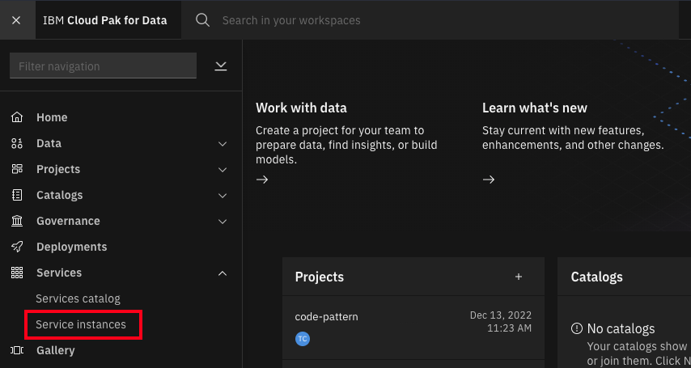
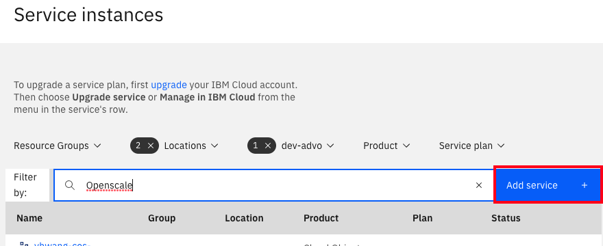
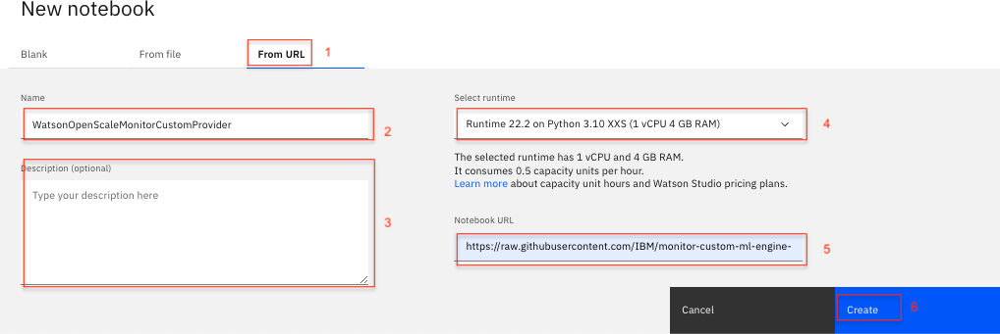

# Monitor Custom Machine Learning engine with Watson OpenScale

In this Code Patten, we'll demonstrate how to monitor a machine learning model using [Watson OpenScale](https://www.ibm.com/cloud/watson-openscale/). You can using any model deployment serving engine, but we will create one using a Python Flask wrapper with Watson Machine Learning to simulate this.

When the reader has completed this Code Pattern, they will understand how to:

* Create a data mart for a machine learning model with [Watson OpenScale](https://www.ibm.com/cloud/watson-openscale/).
* Log the payload for the model using [Watson OpenScale](https://cloud.ibm.com/docs/services/ai-openscale/connect-ml.html#connect-ml)
* Configure OpenScale to monitor that deployment for Fairness, Quality, and Drift.


## Flow

1. User deploys application server on the IBM Cloud using Kubernetes and Docker.
2. User creates a Jupyter notebook on Watson Studio and configures Watson OpenScale and Databases for PostgreSQL.
3. Watson OpenScale is used to monitor a Machine Learning model for payload logging and quality.
4. The application server is used for scoring the deployed model.

## Prerequisites

* A Machine Learning provider, i.e running in a VM on [IBM Cloud ](https://cloud.ibm.com) using the provided Flask app.
* An instance of [Cloud Pak for Data](https://www.ibm.com/products/cloud-pak-for-data).
* Watson OpenScale provisioned on Cloud Pak for Data.
* [IBM Cloud Object Storage (COS)](https://www.ibm.com/cloud/object-storage)

# Steps

1. [Clone the repo](#1-clone-the-repo)
1. [Create custom machine learning provider](#2-create-custom-machine-learning-provider)
1. [Create a Watson OpenScale service](#3-create-a-watson-openscale-service)
1. [Create COS bucket and get credentials](#4-create-cos-bucket-and-get-credentials)
1. [Create a notebook on Cloud Pak for Data](#5-create-a-notebook-on-cloud-pak-for-data)
1. [Run the notebook](#6-run-the-notebook)

## 1. Clone the repo

Clone the `monitor-custom-ml-engine-with-watson-openscale` locally. In a terminal, run:

```bash
git clone https://github.com/IBM/monitor-custom-ml-engine-with-watson-openscale
```

## 2. Create custom machine learning provider

Use your existing machine learning providor

<details><summary>Setup on a VM</summary>

### Custom Machine Learning Provider Setup for VM

The code in flask.py can be used to start a gunicorn/flask application that can be hosted in a VM, such that it can be accessable from CPD system.
This code does the following:
* It wraps a Watson Machine Learning model that is deployed to a space.
* The hosting application URL should contain the SPACE ID and the DEPLOYMENT ID. The app can be used to talk to the target WML model/deployment.
* Having said that, this is only for this tutorial purpose, and you can define your Custom ML provider endpoint in any fashion you want, such that it wraps your own custom ML engine.
* The scoring request and response payload should confirm to the schema as described here at: https://dataplatform.cloud.ibm.com/docs/content/wsj/model/wos-frameworks-custom.html
* To start the application using the below code, make sure you install the python packages using:

```python

pip install -r requirement.txt
```

</details>

or 

<details><summary>Run on RedHat OpenShift</summary>

## Prerequisites

You will need a running OpenShift cluster, or OKD cluster. You can provision [OpenShift on the IBM Cloud](https://cloud.ibm.com/kubernetes/catalog/openshiftcluster).

## Steps

1. [Create an OpenShift project](#1-create-an-openshift-project)
1. [Create the config map](#2-create-the-config-map)
1. [Get a secure endpoint](#3-get-a-secure-endpoint)
1. [Run the web app](#4-run-the-web-app)

### 1. Create an OpenShift project

* Using the OpenShift web console, select the `Application Console` view.

  

* Use the `+Create Project` button to create a new project, then click on your project to open it.

* In the `Overview` tab, click on `Browse Catalog`.

  

* Choose the `Python` app container and click `Next`.

  

* Give your app a name and add `https://github.com/IBM//monitor-custom-ml-engine-with-watson-openscale` for the github repo, then click `Create`.

  

### 2. Create the config map

* Click on the `Resources` tab and choose `Config Maps` and then click the `Create Config Map` button.
  * Provide a `Name` for the config map.
  * Click `Add Item` and add a key named `URL` and under `Enter a value...`, enter auth url of Cloud Pak for Data instance under which the prediction model is deployed.
  * Click `Add Item` and add a key named `USERNAME` and under `Enter a value...`, enter username to Cloud Pak for Data instance under which the prediction model is deployed.
  * Click `Add Item` and add a key named `PASSWORD` and under `Enter a value...`, enter the password to Cloud Pak for Data instance under which the prediction model is deployed.
  * Hit the `Create` button.
  * Click on your new Config Map's name.
  * Click the `Add to Application` button.
  * Select your application from the pulldown.
  * Click `Save`.

  

* Go to the `Applications` tab, choose `Deployments` to view the status of your application.

## 3. Get a secure endpoint

* From the OpenShift or OKD UI, under `Applications` ▷ `Routes` you will see your app.
  * Click on the application `Name`.
  * Under `TLS Settings`, click on `Edit`.
  * Under `Security`, check the box for `Secure route`.
  * Hit `Save`.

## 4. Run the web app

* Go back to `Applications` ▷ `Routes`. You will see your app.

* Save the URL for the Route. You will use this in the [configuration notebook](#5-create-a-notebook-on-cloud-pak-for-data) in the section `1.2 Configure credentials` for the variable *CUSTOM_ML_PROVIDER_SCORING_URL*.

[](../../README.md#create-a-watson-openscale-service)

</details>

### 3. Create a Watson OpenScale service

<details><summary>Setup OpenScale on Cloud Pak for Data if needed</summary>

> Note: This assumes that your Cloud Pak for Data Cluster Admin has already installed and provisioned OpenScale on the cluster.

* In the Cloud Pak for Data instance, go the (☰) menu and under `Services` section, click on the `Instances` menu option.

  

* Find the `OpenScale-default` instance from the instances table and click the three vertical dots to open the action menu, then click on the `Open` option.

  

* If you need to give other users access to the OpenScale instance, go the (☰) menu and under `Services` section, click on the `Instances` menu option.

* Find the `OpenScale-default` instance from the instances table and click the three vertical dots to open the action menu, then click on the `Manage access` option.

  

* To add users to the service instance, click the `Add users` button.

  

* For all of the user accounts, select the `Editor` role for each user and then click the `Add` button.

  

</details>

### 4. Create COS bucket and get credentials

* In your [IBM Cloud Object Storage](https://www.ibm.com/cloud/object-storage)  instance, create a bucket with a globally unique name. The UI will let you know if there is a naming conflict. This will be used in cell *1.3.1* as *BUCKET_NAME*.

* In your [IBM Cloud Object Storage](https://www.ibm.com/cloud/object-storage) instance, get the Service Credentials for use as `COS_API_KEY_ID`, `COS_RESOURCE_CRN`, and `COS_ENDPOINT`:

  

## 5. Create a notebook on Cloud Pak for Data

* In your on-premise Cloud Pak for Data, click `New Project +` under Projects or, at the top of the page click `+ New` and choose the tile for `Data Science` and then `Create Project`.

* Using the project you've created, click on `+ Add to project` and then choose the  `Notebook` tile, OR in the `Assets` tab under `Notebooks` choose `+ New notebook` to create a notebook.

* Select the `From URL` tab. [1]

* Enter a name for the notebook. [2]

* Optionally, enter a description for the notebook. [3]

* For `Runtime` select the `Default Spark Python 3.7 ` option. [4]

* Under `Notebook URL` provide the following url: [https://raw.githubusercontent.com/IBM/monitor-custom-ml-engine-with-watson-openscale/master/notebooks/WatsonOpenScaleAndCustomMLEngine.ipynb](https://raw.githubusercontent.com/IBM/monitor-custom-ml-engine-with-watson-openscale/master/notebooks/WatsonOpenScaleAndCustomMLEngine.ipynb)

* Click the `Create notebook` button. [6]



## 6. Run the notebook

* Move your cursor to each code cell and run the code in it. Read the comments for each cell to understand what the code is doing. **Important** when the code in a cell is still running, the label to the left changes to **In [\*]**:.
  Do **not** continue to the next cell until the code is finished running.

* Add the COS credentials in cell *1.3.1 Cloud object storage details*.

* Insert your BUCKET_NAME in the cell *1.3.1 Bucket name*.

* Either use the internal Database, which requires *No Changes* or Add your `DB_CREDENTIALS` after reading the instructions preceeding that cell and change the cell `KEEP_MY_INTERNAL_POSTGRES = True` to become `KEEP_MY_INTERNAL_POSTGRES = False`.

## License

This code pattern is licensed under the Apache License, Version 2. Separate third-party code objects invoked within this code pattern are licensed by their respective providers pursuant to their own separate licenses. Contributions are subject to the [Developer Certificate of Origin, Version 1.1](https://developercertificate.org/) and the [Apache License, Version 2](https://www.apache.org/licenses/LICENSE-2.0.txt).

[Apache License FAQ](https://www.apache.org/foundation/license-faq.html#WhatDoesItMEAN)
